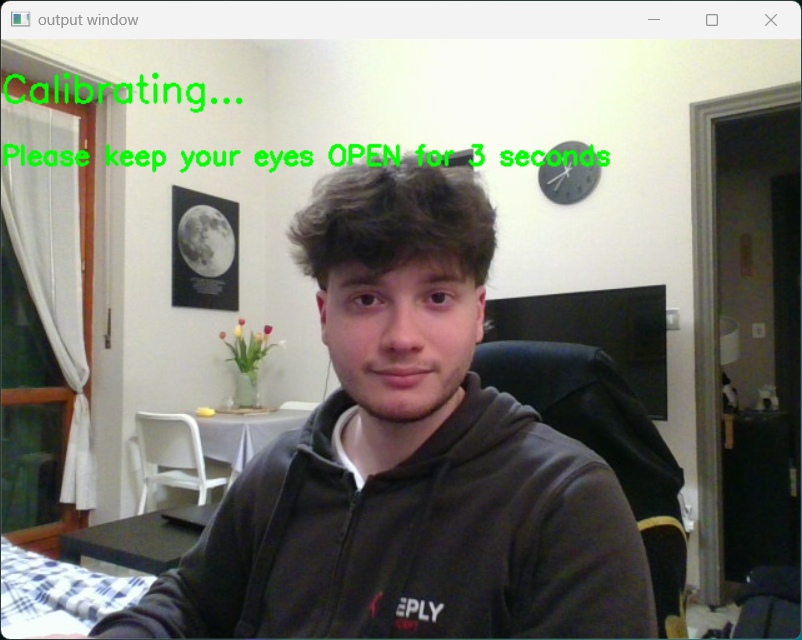
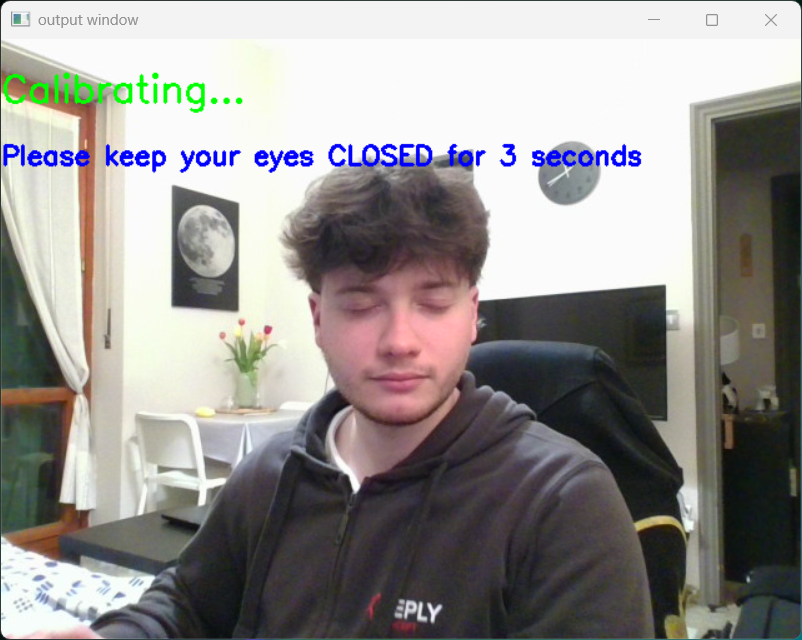
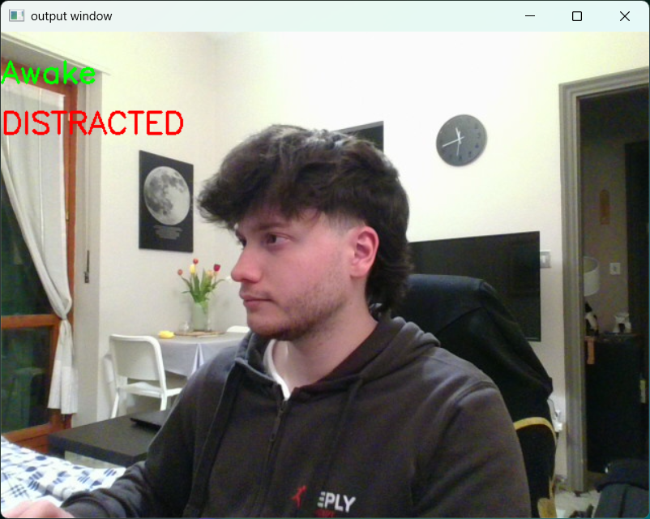
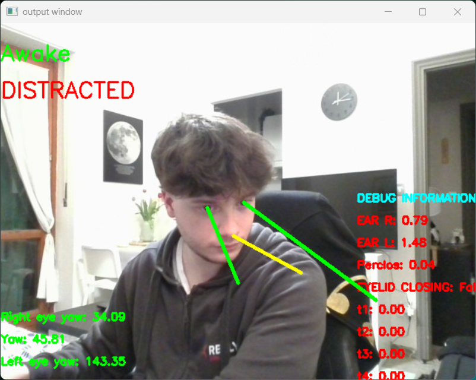

# AI-Powered Driver Monitoring System (DMS)

This project implements a real-time Driver Monitoring System developed for the Technologies for Autonomous Vehicles course at the Politecnico di Torino.

The system uses a webcam feed with MediaPipe Face Mesh and OpenCV to detect driver drowsiness and distraction, based on facial landmarks and head/eye orientation.

## Features

- Dynamic EAR Calibration – personalized thresholds for open/closed eyes  
- Drowsiness Detection using:  
  - Eye Aspect Ratio (EAR)  
  - PERCLOS 80 (Percentage of Eye Closure)  
- Distraction Detection via:  
  - 3D head and eye pose estimation (yaw > 30°)  
- Debug Mode – display internal metrics and directional lines

## Installation

Make sure to install the required dependencies:

```
pip install opencv-python mediapipe numpy
```

## How to Run

```
python main.py
```

### Calibration Phase

1. Eyes Open: Look straight and keep eyes open for 3 seconds  
2. Eyes Closed: Gently close your eyes for 3 seconds  

Avoid exaggerated expressions. Natural eye movement improves accuracy.

## Debug Mode

To enable debug visuals (EAR, PERCLOS, angles), set the following in `main.py`:

```
DEBUG = True
```

This will display:  
- Real-time EAR values (per eye)  
- Timers used in PERCLOS  
- Yaw angles (head and eyes)  
- Visual directional lines

## Example images 

The following images are an example meant to show functionalities

### Calibration Phase  
  


### Regular View  


### Debug View  



## Reference

Zulkarnanie, Enhancements to PERCLOS Algorithm for Determining Eye Closures,  
2022 International Conference on Future Trends in Smart Communities (ICFTSC), pp. 76–81

## Author

Emanuele Giuseppe Siani  
s330980@studenti.polito.it  
Politecnico di Torino
