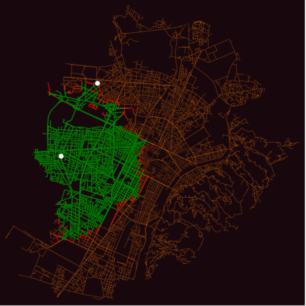
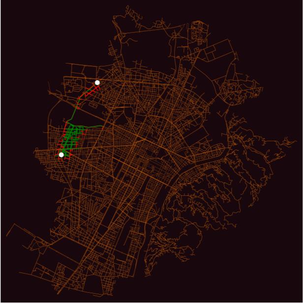
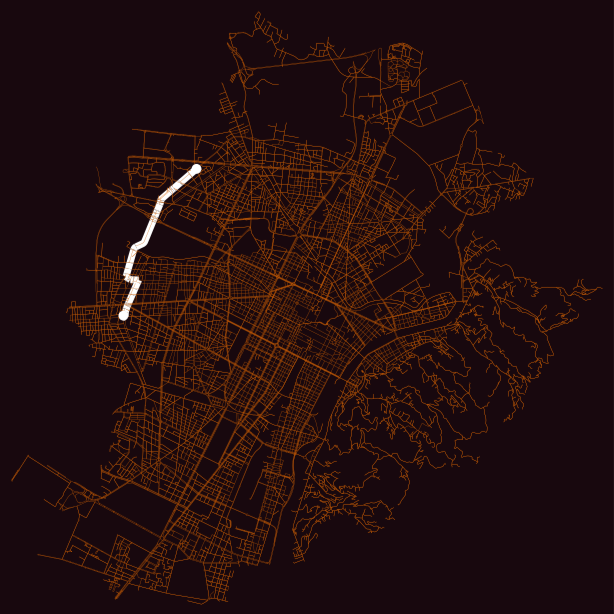
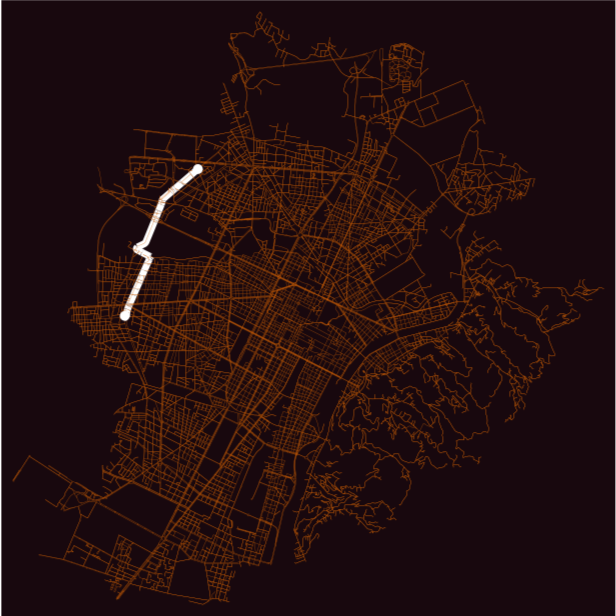

# Comparative Analysis of A* and Dijkstra Pathfinding Algorithms

This project presents a comparative study of two popular pathfinding algorithms—A* and Dijkstra—implemented and tested on real-world urban road networks from Turin, Italy, and Piedmont, California.

Developed as part of the *Technologies for Autonomous Vehicles* course at the Politecnico di Torino, the project investigates the computational performance and path quality of each algorithm when applied to urban navigation problems.

## Features

- Full implementation of A* and Dijkstra algorithms on road network graphs
- Use of Haversine distance as a heuristic, converted to time using average urban speed (40 km/h)
- Real-world datasets from two urban environments:
  - Turin, Italy (large, dense European city)
  - Piedmont, California (small, simpler town)
- Comparison metrics:
  - Number of explored nodes (iterations)
  - Total travel time (seconds)
- Visualization of explored nodes and optimal paths

## Key Findings

- **A\*** significantly reduces the number of iterations:
  - Up to **-88.6% fewer iterations** in Turin
  - Maintains near-optimal path costs (within **1%** of Dijkstra)
- In smaller graphs like Piedmont, A* still outperforms Dijkstra in efficiency (47% fewer steps), with **identical optimal path costs**
- Time-based heuristics ensure correctness and maintain optimality

## Installation

Clone the repository and install required Python packages:

```bash
pip install osmnx numpy matplotlib
```

## How to Run

To run the algorithm comparison:

```bash
python main.py
```

The script:
- Loads graph data
- Randomly selects start and destination nodes
- Runs both A* and Dijkstra
- Collects performance metrics
- Visualizes the explored nodes and computed path

## Visualization

The script generates side-by-side comparisons:

- Explored nodes (in green)
- Start and destination nodes (in white)
- Computed optimal paths (in white)

### Example: Turin (Dijkstra vs A*)







## Reference

Politecnico di Torino  
Technologies for Autonomous Vehicles — Assignment 2  
Author: Emanuele Giuseppe Siani  
s330980@studenti.polito.it
